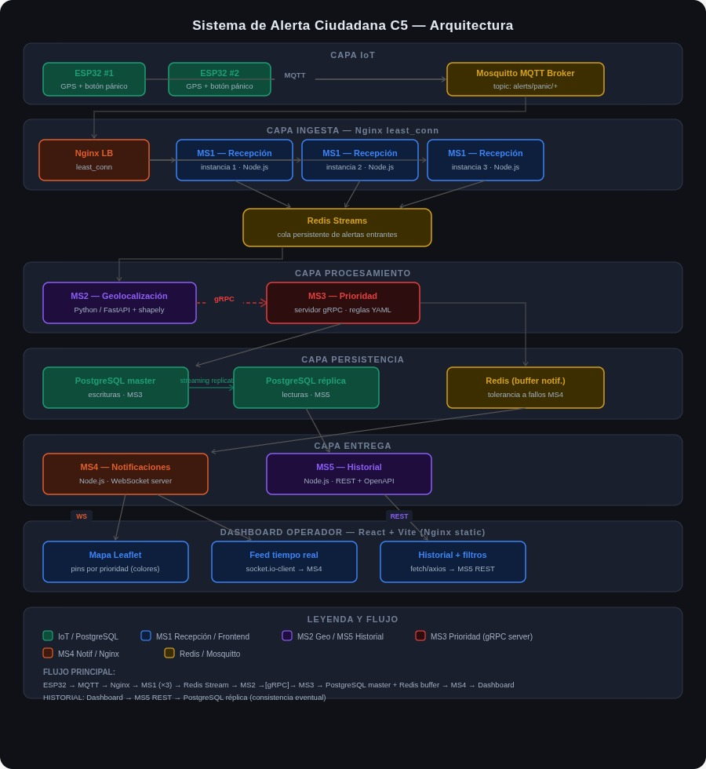

# Sistema de Alerta Ciudadana C5

Un sistema distribuido de recepción y procesamiento de alertas ciudadanas en tiempo real, diseñado para gestionar múltiples fuentes IoT (ESP32 con GPS y botón de pánico) y entregar notificaciones prioritarias a través de un dashboard operador interactivo.

## 📋 Descripción General

El Sistema de Alerta Ciudadana C5 es una plataforma escalable que:
- Recibe alertas IoT desde dispositivos ESP32 con geolocalización
- Procesa y prioriza alertas en tiempo real
- Persiste información en bases de datos replicadas
- Entrega notificaciones inmediatas a operadores
- Proporciona un dashboard interactivo con visualización de alertas

## 🏗️ Arquitectura



## 🧩 Componentes Principales

### IoT
- **ESP32 (×2)**: Dispositivos con GPS y botón de pánico para captura de alertas

### CAPA INGESTA
- **Mosquitto MQTT Broker**: Recepción de datos IoT
- **Nginx LB**: Load balancer para distribuir carga
- **MS1 (Recepción)**: Microservicio que procesa conexiones MQTT (3 instancias)

### CAPA PROCESAMIENTO
- **MS2 (Geolocalización)**: Procesa coordenadas GPS y enriquece datos geográficos
- **MS3 (Prioridad)**: Clasifica alertas por nivel de prioridad

### CAPA PERSISTENCIA
- **PostgreSQL Master**: Base de datos principal (estructuras MS3)
- **PostgreSQL Replica**: Base de datos replicada (lecturas MS5)
- **Redis**: Buffer de notificaciones y caché distribuido

### CAPA ENTREGA
- **MS4 (Notificaciones)**: Envía alertas a operadores (Node.js + WebSocket server)
- **MS5 (Historial)**: Consulta y retorna historial de alertas (Node.js + REST)

### FRONTEND
- **Mapa Leaflet**: Visualización geoespacial de alertas
- **Feed en tiempo real**: Socket.io/client para actualizaciones en vivo
- **Dashboard Historial**: Filtros avanzados y búsqueda de alertas históricas

## 🛠️ Stack Tecnológico

### Backend & Microservicios
- **Node.js**: MS1, MS4, MS5
- **Python**: MS2, MS3
- **gRPC**: Comunicación entre servicios
- **Redis**: Stream de alertas, cache, notificaciones

### Bases de Datos
- **PostgreSQL**: Persistencia de alertas e historial
- **Redis Streams**: Cola persistente de eventos

### IoT & Comunicación
- **MQTT**: Protocolo para dispositivos IoT
- **Mosquitto**: Broker MQTT
- **WebSocket**: Comunicación en tiempo real Dashboard

### Frontend
- **React**: Framework principal
- **Leaflet**: Mapas interactivos
- **Socket.io Client**: Actualizaciones en tiempo real
- **Nginx**: Servidor web estático

### Orquestación
- **Nginx**: Load balancing

## 📦 Requisitos Previos

- **Node.js** >= 16.x
- **Python** >= 3.8
- **PostgreSQL** >= 12
- **Redis** >= 6.0
- **Mosquitto** >= 2.0
- **Docker** (opcional, para fácil setup)

## 🚀 Instalación & Setup Local

### 1. Clonar el repositorio
```bash
git clone https://github.com/TerrazasJr316/SystemAlert.git
cd SystemAlert
```

### 2. Variables de Entorno
Crear archivos `.env` en cada microservicio con las credenciales locales. Ver [CONTRIBUTING.md](CONTRIBUTING.md) para detalles.

### 3. Iniciar Servicios

#### Opción A: Docker (Recomendado)
```bash
docker-compose up -d
```

#### Opción B: Manual
```bash
# Terminal 1: Mosquitto MQTT
mosquitto -c /path/to/config

# Terminal 2: PostgreSQL
# Asegurate de que esté corriendo en puerto 5432

# Terminal 3: Redis
redis-server

# Terminal 4: MS1 (Nginx + Node)
cd services/ms1-recepcion
npm install && npm start

# Terminal 5: MS2 (Python Geolocalización)
cd services/ms2-geolocalización
pip install -r requirements.txt && python main.py

# Terminal 6: MS3 (Python Prioridad)
cd services/ms3-prioridad
pip install -r requirements.txt && python main.py

# Terminal 7: MS4 (Node Notificaciones)
cd services/ms4-notificaciones
npm install && npm start

# Terminal 8: MS5 (Node Historial)
cd services/ms5-historial
npm install && npm start

# Terminal 9: Frontend React
cd frontend
npm install && npm start
```

## 📖 Documentación & Desarrollo

Para instrucciones de desarrollo, ver [CONTRIBUTING.md](CONTRIBUTING.md)

## 🔄 Flujo de Datos

1. **ESP32** → Publica ubicación + tipo de alerta a MQTT
2. **Mosquitto** → Distribuye a MS1 (via Nginx LB)
3. **MS1** → Valida y serializa, envía a Redis Stream
4. **MS2** → Procesa geolocalización
5. **MS3** → Asigna prioridad
6. **PostgreSQL** → Persiste alerta
7. **Redis Buffer** → Notificaciones en cola
8. **MS4** → Envía notificación a Dashboard (WebSocket)
9. **MS5** → Disponibiliza historial via REST
10. **Dashboard React** → Visualiza en Mapa + Feed

## 🌐 Endpoints Principales

- **Dashboard**: `http://localhost:3000`
- **API Historial (MS5)**: `http://localhost:4000`
- **WebSocket Notificaciones (MS4)**: `ws://localhost:4001`
- **MQTT Broker**: `localhost:1883`
- **PostgreSQL**: `localhost:5432`
- **Redis**: `localhost:6379`

## 🔒 Notas de Seguridad

⚠️ **Importante**: Este sistema está en desarrollo local. Antes de producción:
- Implementar autenticación JWT en APIs
- Validar y sanitizar datos de IoT
- Usar MQTT con credenciales
- Implementar TLS/SSL en comunicaciones
- Configurar CORS apropiadamente
- Auditar acceso a bases de datos

## 📝 Licencia

[Agregar licencia del proyecto]

## 👥 Contribuidores

Ver [CONTRIBUTING.md](CONTRIBUTING.md) para cómo contribuir al proyecto.

## 📞 Soporte

Para problemas o sugerencias, crear un issue en el repositorio o contactar al equipo de desarrollo.

---

**Última actualización**: Junio 2026
